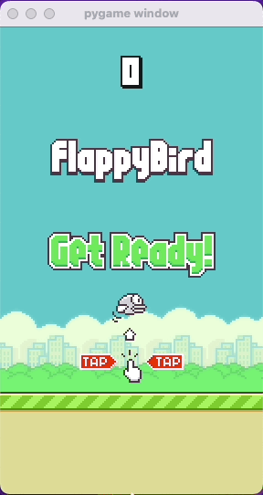

# Flappy Bird Game

This project contains a Flappy Bird game developed using the Python programming language and the Pygame game development library. In this project, reflecting the classic and entertaining game mechanics, players control a bird and navigate it through obstacles to see how long they can survive.

## Gameplay

The player's objective is to control the bird, maneuvering it through pipes and earning the highest score possible. Players can make the bird flap upwards by pressing the spacebar on the keyboard. However, precise timing is essential to prevent the bird from falling too quickly. If the bird collides with pipes or the ground, the game ends.

## How to Play

1. Clone the project files to this repository.
2. Ensure that you have Python 3 and the Pygame library installed on your computer.
3. Navigate to the project directory in your terminal.
4. Start the game by using the command `python3 main.py`.
5. Use the spacebar key on the keyboard to control the bird's upward movement.
6. If the player collides, they can **restart** the game by pressing the ESC key.

## License

This project is licensed under the Apache License 2.0. For more information, please refer to the `LICENSE` file.

---

